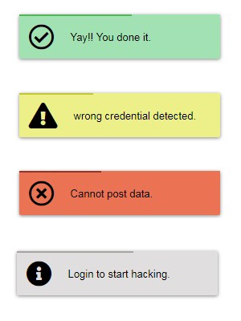

# ic-react-toast


## Introduction

`ic-react-toast` is a toast notification  library for react applications.<br><br>
There are four types of toast available with this package.<br><br>
`1. Toaster.success(msg)`<br>
`2. Toaster.warning(msg)`<br>
`3. Toaster.error(msg)`<br>
`4. Toaster.info(msg)`<br>




## Install

```
$ npm install ic-react-toast
```

## Usage

```js
import React, { Component } from 'react';
import {ToastContainer,Toaster} from 'ic-react-toast';

// ...

render() {
  return (
    <div>
      <button onClick={() => Toaster.success('Yay!!! You did it')}>Toast</button>
      <button onClick={() => Toaster.warning('Wrong credential detected.')}>Toast</button>
      <button onClick={() => Toaster.error('Cannot post data')}>Toast</button>
      <button onClick={() => Toaster.info('login to start hacking.')}>Toast</button>
      
      <ToastContainer />
    </div>
  );
}
```
